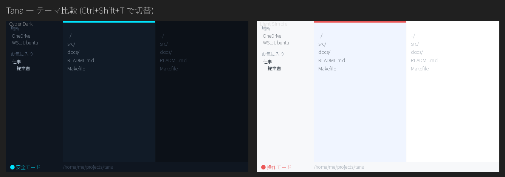

# Tana (棚) - 設計ドキュメント

> 最終更新: 2026-06-08
> バージョン: 0.1.0 (ドラフト)
> 要求の根拠は [REQUIREMENTS.md](REQUIREMENTS.md) を参照(本書中の `FR-xx` / `NFR-xx` はそのID)

---

## 1. プロジェクト概要

- **製品名**: Tana (棚)
- **目的**: ローカル / WSL / クラウド同期フォルダを横断して扱える、超軽量・ポータブルなクロスプラットフォーム ファイラ
- **技術スタック**: Tauri v2 (Rust) + Vanilla JS + esbuild
- **識別子(暫定)**: `com.tana.app`
- **ターゲットバイナリサイズ**: ~数MB(Fude 同等。`strip=true`, `lto=true`, `opt-level="s"`)
- **姉妹プロジェクト**: [Fude(筆)](https://github.com/dobachi/fude) — 構成・スキル・ビルドノウハウを流用(NFR-S2)

### 設計思想

- **軽量・高速起動 (NFR-P1,2)**: Electron ではなく Tauri。フレームワーク不使用の Vanilla JS
- **安全第一 (G5)**: 起動時は安全モード。破壊的操作はモード切替時のみ
- **横断アクセス (G1)**: クラウド/WSL を「場所」として検出。特別な設定なしに開ける
- **キーボードにもマウスにも (G3)**: 全機能キーボード到達 + D&D/コンテキストメニュー
- **ミニマル (NFR-U1)**: CSS変数によるテーマ、装飾を排した情報密度

---

## 2. アーキテクチャ

### 2.1 全体構成

```
┌────────────────────────────────────────────────────────────────┐
│                        Tauri Window                            │
│ ┌──────────┐ ┌──────────────────────────┐ ┌────────────────┐  │
│ │ Sidebar   │ │        Workspace          │ │   Preview      │  │
│ │           │ │ ┌──────────┬───────────┐ │ │  (Should)      │  │
│ │ Places    │ │ │  Pane L   │  Pane R   │ │ │                │  │
│ │ Favorites │ │ │ (file     │ (file     │ │ │ 画像/テキスト/ │  │
│ │ (nested,  │ │ │  list +   │  list +   │ │ │ Markdown ...   │  │
│ │  search)  │ │ │  tabs)    │  tabs)    │ │ │                │  │
│ │           │ │ └──────────┴───────────┘ │ │                │  │
│ └──────────┘ └──────────────────────────┘ └────────────────┘  │
│ [Status Bar:  ●安全モード / ●操作モード  |  パス  |  選択数 ]   │
└────────────────────────────────────────────────────────────────┘
```

- **Sidebar**: 場所(Places)一覧(FR-07)とお気に入り(FR-05,06)
- **Workspace**: 2ペイン(FR-01)。各ペインはタブ(FR-08, Should)を持つ
- **Preview**: 選択ファイルのプレビュー(FR-09, Should)。**配置は「2ペインの右」/「2ペインの下」を切替可能**(縦長ファイルや横並びファイル比較で使い分け)
- **Status Bar**: 現在モードの視覚表示(NFR-U3)・現在パス・選択数

### 2.2 レイヤ構成

```
Frontend (Vanilla JS / WebView)
  ├─ app.js           メインオーケストレーター(初期化・キーバインド・モード状態)
  ├─ backend.js       Tauri invoke 抽象化(HTTP fallback 余地は Fude に倣う)
  ├─ core/            常時ロード
  │   ├─ pane.js          ペイン(ディレクトリリスト・選択・カーソル)
  │   ├─ panes.js         2ペイン管理・アクティブペイン・ペイン間操作
  │   ├─ fileops.js       コピー/移動/削除/リネーム/新規(安全モードでゲート)
  │   ├─ safemode.js      安全/操作モードの状態と切替・操作可否判定
  │   ├─ favorites.js     ネスト可能お気に入りツリー + 検索
  │   ├─ places.js        場所(Places)検出結果の保持・表示
  │   ├─ keymap.js        キーバインド定義(全機能到達)
  │   └─ session.js       セッション/設定の保存・復元
  └─ features/        動的 import(トグル可能)
      ├─ tabs.js          タブ管理(Should)
      └─ preview/         形式別プレビュー(Should, 遅延ロード)

Backend (Rust / Tauri Commands)
  ├─ fs.rs            ディレクトリ列挙・メタ情報・ファイル操作(copy/move/rename/trash)
  ├─ places.rs        OS別の場所検出(OneDrive/Box/WSL/標準フォルダ)
  ├─ preview.rs       プレビュー用データ取得(必要に応じ)
  └─ settings.rs      お気に入り/設定の永続化
```

> ディレクトリ構成は Fude(`src-tauri/` + `src/js/{core,features}`)を踏襲し、重量級機能は動的 import で遅延ロードする(不要機能の JS をロードしない)。

---

## 3. 主要機能の設計

### 3.1 2ペイン & ファイル操作 (FR-01,02,03 / Must)

- 左右2ペイン。**アクティブペイン**の概念を持ち、`Tab` でフォーカス移動
- ペイン間操作の基本動作:
  - **コピー**: アクティブ → 非アクティブ ペインへ(`F5` 系 or `Ctrl+C` → `Ctrl+V`)
  - **移動**: 同上(`F6` 系 or 切り取り→貼り付け)
  - **削除**: ゴミ箱経由を既定(NFR-R2)。完全削除は明示修飾(例 `Shift+Delete`)
  - **リネーム/新規フォルダ**: インライン編集
- マウス: D&D でペイン間移動/コピー、`Ctrl`/`Shift` で複数選択、右クリックでコンテキストメニュー(FR-11)
- すべての操作はキーボードからも実行可能(FR-10)
- 大量ファイルは**仮想スクロール**で描画(NFR-P3)

### 3.2 安全モード (FR-04 / NFR-R1,U3 / Must)

中核の安全機構。詳細要求は [REQUIREMENTS.md §5](REQUIREMENTS.md#5-安全モードの要求詳細)。

- **状態**: `safe`(既定) / `operation`
- **状態管理**: `core/safemode.js` が単一の真実源。`fileops.js` は破壊的操作の前に `safemode.canMutate()` を必ず通す(UIだけでなくロジック層でゲート)
- **切替ショートカット(暫定)**: 単一キーのトグル。候補: `F2`(慣習的にリネームと衝突するため要再考) → 暫定 **`Ctrl+Shift+Space`** をトグルに割当。確定は Open Issue Q1
- **視覚表示 (NFR-U3)**:
  - ステータスバー左に `● 安全モード`(寒色) / `● 操作モード`(暖色)
  - 操作モード時はウィンドウ枠/ペインヘッダに暖色アクセントを付与
- **抑止時フィードバック**: 安全モード中に破壊的操作キー/メニューを実行 → トーストで「安全モードです(切替: Ctrl+Shift+Space)」
- **境界**: 「読み取り(列挙・プレビュー・パス文字列コピー・お気に入り参照)」は常に許可。「書き込み(移動・コピー先・貼付・削除・リネーム・新規・上書き)」は操作モードのみ

```
[破壊的操作の要求]
      │
      ▼
 safemode.canMutate() ──false──▶ トースト「安全モードです」/ 何もしない
      │ true
      ▼
 (上書き等なら) 確認ダイアログ (NFR-R3)
      │ 承認
      ▼
 backend: fs.rs で実行(削除はゴミ箱経由)
```

### 3.3 お気に入り(ネスト + 検索) (FR-05,06 / Must)

- データモデル: ツリー構造。フォルダ(子を持てる)とブックマーク(パスを指す葉)
  ```jsonc
  // favorites.json (アプリ設定ディレクトリ。Open Issue Q4)
  {
    "version": 1,
    "root": [
      {
        "type": "folder",
        "name": "仕事",
        "children": [
          { "type": "bookmark", "name": "提案書", "path": "C:/Users/me/OneDrive/proposals" },
          {
            "type": "folder",
            "name": "案件A",
            "children": [
              /* ... */
            ],
          },
        ],
      },
      { "type": "bookmark", "name": "WSL home", "path": "\\\\wsl$\\Ubuntu\\home\\me" },
    ],
  }
  ```
- **検索 (FR-06)**: 名前・パスに対するインクリメンタル検索。マッチした葉を、所属フォルダのパンくず付きでフラット表示
- 並べ替え・D&D による再編成(操作モードを要するかは「お気に入りは設定でありファイル破壊ではない」ため安全モードでも許可とする方針 → Q1 周辺で確定)

### 3.4 場所(Places)検出 (FR-07 / Should)

- `backend: places.rs` が OS 別に候補を検出([REQUIREMENTS.md §6](REQUIREMENTS.md#6-場所places検出に関する要求)):
  - **Windows**: `%USERPROFILE%` 配下の `OneDrive*`、既知フォルダ(Documents/Desktop/Downloads)、マウント済みドライブ(Box 等)、`\\wsl$\` 配下のディストロ
  - **macOS / Linux**: ホーム標準フォルダ、マウントポイント、(あれば)クラウド同期フォルダ
- 検出は**ヒューリスティック**(存在チェック)で、失敗しても手動追加でカバー(堅牢性)
- 検出結果はサイドバー「場所」に表示。クリック/キーで該当パスへジャンプ

### 3.5 タブ (FR-08 / Should)

- ペインごとに複数タブ。各タブは「カレントディレクトリ + スクロール/選択状態」を保持
- `features/tabs.js` として動的ロード(MVPでは無効化可能)

### 3.6 プレビュー (FR-09 / Should)

- `features/preview/` に形式別レンダラ。最小セット: 画像・プレーンテキスト・Markdown(Fude の markdown-it 流用余地)
- PDF・コード ハイライト等は段階拡張。重量級は遅延ロード(NFR-P2)
- **配置**: 「2ペインの右」/「2ペインの下」を切替可能。CSS Grid のテンプレートを差し替えるだけで実現し、選択値はセッションに保存(FR-14)

### 3.7 コンテキストメニュー & 外部アプリ連携 (FR-13 / Must)

- マウス右クリック、およびキーボード(メニューキー / `Shift+F10`)で同一のコンテキストメニューを開く(NFR-U2: キーボードでも到達)
- メニュー項目はモード依存(NFR-U3): 安全モードでは破壊的項目(削除・リネーム・切り取り等)を無効化表示
- **外部アプリ連携**:
  - OS標準の「プログラムから開く / Open With」を呼び出し(`open`/`xdg-open`/`start` 相当を `backend: fs.rs` 経由)
  - 7-Zip 等のよく使う外部ツールを**ユーザー定義コマンド**として登録し、選択ファイルを引数に起動(例: 圧縮・展開)。設定に保持
- 外部プロセス起動は backend(Rust)側で実装し、フロントからは invoke で要求

### 3.11 文字サイズ / 設定 (NFR-U5)

- **全体の文字サイズ**を `core/fontscale.js` で管理(真実源)。CSS 変数 `--font-scale`(既定1)を `<html>` に設定し、`body` の `font-size: calc(13px * var(--font-scale))` を起点に各要素は `em` で追従(単一変数で全体拡縮)。
- 倍率は 0.8〜1.6 を 0.1 刻みでクランプ。選択は `localStorage` に永続化。
- 操作: `Ctrl++` / `Ctrl+-` / `Ctrl+0`(拡大/縮小/リセット)。変更時はトーストで `%` を表示。
- **設定画面(将来)**: テーマ(NFR-U4)・文字サイズ(NFR-U5)・隠しファイル既定・外部アプリ(FR-13)等を一覧編集する設定画面を後で実装予定。各設定は本モジュール群(`theme.js` / `fontscale.js` 等)を**真実源**とし、設定画面は薄い UI として `get/set` を呼ぶだけにする。永続化は将来セッション/設定(FR-14)へ統合。

### 3.10 隠しファイル表示 (FR-15)

- バックエンド `list_dir` は各エントリに `is_hidden` を付与(先頭ドット、Windows は隠し属性も判定)。一覧自体は全件返す。
- フロント `core/filepane.js` が `showHidden` フラグで表示をフィルタ(`filterEntries`)。再取得不要で**トグルが即時**。
- `Ctrl+H` で**両ペイン共通**に切替(`app.js` が状態を保持し各ペインへ反映)。隠しエントリは薄く表示(`.is-hidden`)。
- 既定は非表示。将来はセッション(FR-14)に保存。

### 3.8 セッション復元 (FR-14)

> ロードマップ補足: 「開いていたタブ・ディレクトリを保存/保持したい」という要望に対応。

- **保存対象**: 各ペインのカレントディレクトリ、アクティブペイン、(タブ有効時)各ペインのタブ構成と選択タブ、プレビュー配置、テーマ、安全/操作モードの初期値方針
- **保存方式**: Fude の `session.js` を踏襲し、変更をデバウンスして JSON 永続化(`core/session.js` + `backend: settings.rs`)
- **復元**: 起動時にセッションを読み込み、ディレクトリ/ペイン状態を再現。存在しなくなったパスはスキップし、近い既知の場所へフォールバック(堅牢性)
- **段階導入**: 基本(ディレクトリ・ペイン状態)は M1、タブ込みの完全復元はタブ(FR-08)と同じ M2

### 3.9 テーマ (NFR-U4)

- **2テーマ**を明示選択(`prefers-color-scheme` 自動ではなく、ユーザーが選んで固定):
  - **サイバーダーク**(既定): 近黒背景 + ネオンアクセント(安全=シアン `#00e5ff` / 操作=マゼンタ `#ff3d7f`)、アクティブペインにグロー
  - **白基調シンプル**: 白基調 + 余白とコントラスト重視(安全=青 `#2f80ed` / 操作=赤 `#eb5757`)
- **実装**: `core/theme.js` が状態の真実源。`<html data-theme="...">` に反映し、CSS変数(`:root[data-theme]`)でパレットを切替。選択は `localStorage`(将来はセッション/設定へ統合, FR-14)に永続化
- 安全/操作モードのアクセント色はテーマ側で定義し、`data-mode` と組み合わせて表示(モード視覚表示 NFR-U3 はテーマに依らず機能)
- 切替: `Ctrl+Shift+T`(将来は設定画面でも選択可)



---

## 4. キーバインド設計(暫定)

| 操作                                        | キー(v1)                                | モード要件             |
| ------------------------------------------- | --------------------------------------- | ---------------------- |
| カーソル移動(上 / 下)                       | `k` / `j`(または `↑` / `↓`)             | 常時                   |
| 親へ戻る / ディレクトリへ入る               | `h` / `l`(または `Backspace` / `Enter`) | 常時                   |
| ペイン切替(L↔R)                             | `Tab`                                   | 常時                   |
| サイドバー(場所/お気に入り)へ・から         | `Ctrl+B`(トグル)                        | 常時                   |
| 領域間フォーカス(空間移動)                  | `Ctrl+Alt+h` / `Ctrl+Alt+l`             | 常時                   |
| 安全 / 操作モード切替                       | `Ctrl+Shift+Space`                      | 常時                   |
| テーマ切替(サイバーダーク ⇄ 白基調シンプル) | `Ctrl+Shift+T`                          | 常時                   |
| 隠しファイル表示切替                        | `Ctrl+H`                                | 常時                   |
| 文字サイズ 拡大 / 縮小 / リセット           | `Ctrl++` / `Ctrl+-` / `Ctrl+0`          | 常時                   |
| コンテキストメニュー表示                    | メニューキー / `Shift+F10`              | 常時(項目はモード依存) |
| コピー(ペイン間)                            | `F5`                                    | 操作のみ               |
| 移動(ペイン間)                              | `F6`                                    | 操作のみ               |
| 削除(ゴミ箱)                                | `Delete`                                | 操作のみ               |
| 完全削除                                    | `Shift+Delete`                          | 操作のみ + 確認        |
| リネーム                                    | `F2`                                    | 操作のみ               |
| 新規フォルダ                                | `F7`                                    | 操作のみ               |
| お気に入り検索                              | `Ctrl+F`(サイドバー内)                  | 常時                   |
| パス入力                                    | `Ctrl+L`                                | 常時                   |

> `hjkl` はファイルリスト/サイドバーにフォーカスがある時のみ有効(テキスト入力中は通常文字)。慣習(`F5`コピー/`F6`移動 は Total Commander 系)を踏襲しつつ、安全モードキーは衝突しない `Ctrl+Shift+Space` に確定(Open Issue Q1 解決)。

### 4.1 フォーカス移動の設計(お気に入り ↔ ペイン)

「お気に入りとペインの移動をどうするか/タブでよいか」への設計方針。フォーカス可能領域は **サイドバー(場所+お気に入り)/ ペインL / ペインR** の3つ。

- **`Tab` はペイン往復(L↔R)専用に温存**: 最頻操作なので1キー1往復で速い。`Tab` で3領域以上を巡回させると、肝心のペイン往復が遠くなるため採らない。
- **サイドバーへは `Ctrl+B`(トグル)**: エディタ系の慣習に沿って表示/フォーカスをまとめて切替。`Esc` または `Ctrl+B` でペインへ戻る。
- **空間移動 `Ctrl+Alt+h` / `Ctrl+Alt+l`**: `hjkl` 採用と一貫した「左=サイドバー、中=ペインL/R」の空間メタファで領域間を移動。`Tab`(トグル)と空間移動の2系統を用意し、好みで使える。(`Ctrl+H` は隠しファイル切替に割当のため、空間移動は `Ctrl+Alt` 修飾にした。)
- **お気に入り内の操作はリストと一貫**: サイドバーにフォーカス時、`j/k` で上下、`h/l` でフォルダの折畳/展開、`Enter` で選択先をアクティブペインに開く。

> 「タブ」案について: タブはあくまで**ペイン内のロケーション切替**(FR-08)に用い、領域フォーカスの移動には使わない。役割を分離することで、タブが増えても領域移動の操作感が一定に保たれる。

---

## 5. 非機能設計

| 区分               | 方針                                                                         |
| ------------------ | ---------------------------------------------------------------------------- |
| 性能 (NFR-P1,2,3)  | Tauri + Vanilla JS、動的 import、仮想スクロール、Release で strip/lto        |
| 移植性 (NFR-S1)    | Tauri ネイティブビルドで Win/Mac/Linux。WSL は Windows 側からの UNC パス対応 |
| 信頼性 (NFR-R)     | 既定安全モード、ゴミ箱経由削除、上書き/大量操作の確認、Undo(Could)           |
| 使いやすさ (NFR-U) | CSS変数テーマ、モード視覚表示、キー/マウス同等サポート                       |

---

## 6. ロードマップ

| フェーズ    | 含む要求                                                                                                                                                                                                                                     |
| ----------- | -------------------------------------------------------------------------------------------------------------------------------------------------------------------------------------------------------------------------------------------- |
| **M0 雛形** | Tauri v2 + esbuild + Vitest の足場(Fude 構成移植)、ウィンドウ + 空2ペイン                                                                                                                                                                    |
| **M1 MVP**  | FR-01,02,03(2ペイン+操作)/ FR-04(安全モード)/ FR-05,06(お気に入り)/ FR-10,11(キー/マウス, `hjkl` 移動)/ FR-13(コンテキストメニュー+外部アプリ連携)/ **FR-14 基本(開いていたディレクトリ・ペイン状態のセッション復元)** / NFR-U/R/P/S の Must |
| **M2**      | FR-07(Places)/ FR-08(タブ)/ **FR-14 完全(開いていたタブ込みのセッション復元)** / FR-12(パス入力・パンくず)                                                                                                                                   |
| **M3**      | FR-09(プレビュー拡張・配置切替)/ NFR-R4(Undo)/ キーモード等 Could                                                                                                                                                                            |
| **将来**    | クラウドAPI直結 / 全文検索 / プラグイン(REQUIREMENTS §7)                                                                                                                                                                                     |

---

## 7. 未決事項

[REQUIREMENTS.md §8](REQUIREMENTS.md#8-未決事項-open-issues) と同期。特に設計で先に潰すべきは Q1(キー体系・安全モードキー)と Q4(お気に入り保存)。
